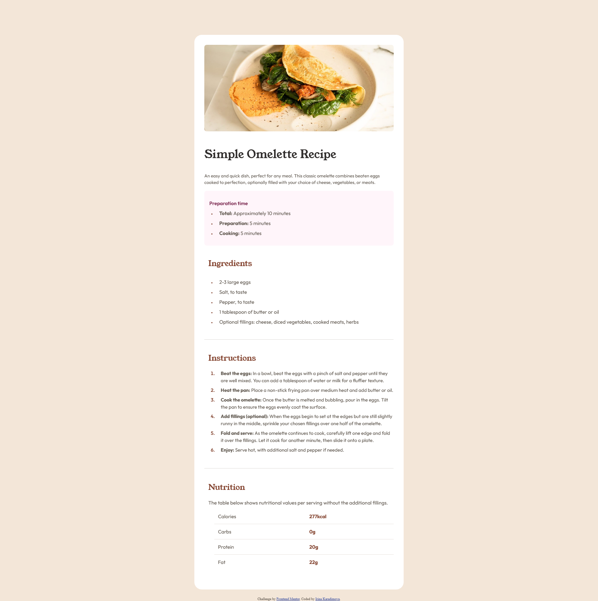

# Frontend Mentor - Recipe page solution

This is a solution to the [Recipe page challenge on Frontend Mentor](https://www.frontendmentor.io/challenges/recipe-page-KiTsR8QQKm).

## Table of contents

- [Overview](#overview)
  - [The challenge](#the-challenge)
  - [Screenshot](#screenshot)
  - [Links](#links)
- [My process](#my-process)
  - [Built with](#built-with)
  - [What I learned](#what-i-learned)
- [Author](#author)

## Overview

### Screenshot

### Links

- Live Site URL: [My Solution](https://irinakrdmva.github.io/Recipe-Page/)

## My process

### Built with

- Semantic HTML5 markup
- CSS custom properties
- Flexbox
- CSS Grid

### What I learned

I have improved my control over margins and paddings. Got familiar with bullet points manipulation in CSS (::marker).
Overall nice project that was a bit challenging in some aspects, but trough challenge we learn and develop.😁

## Author

- Website - [IrinaKrdmva](https://irinakrdmva.pt)
- Frontend Mentor - [@yourusername](https://www.frontendmentor.io/profile/IrinaKrdmva)
